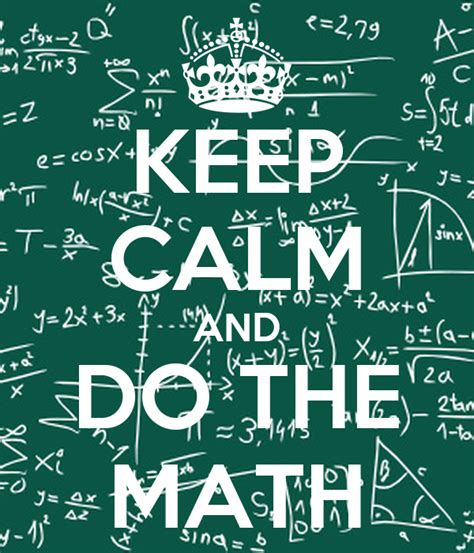
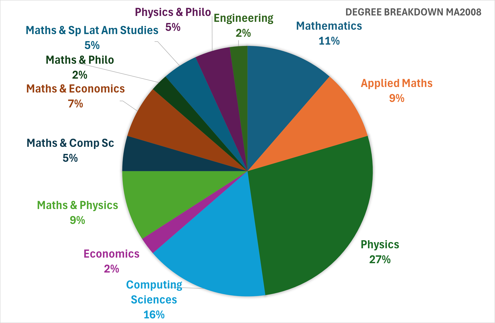
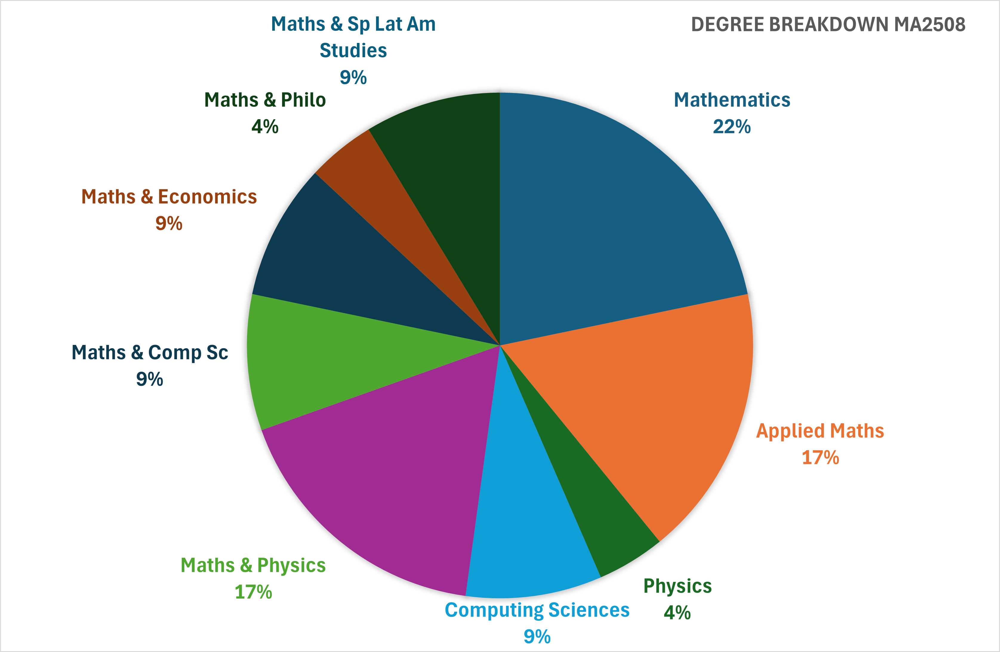
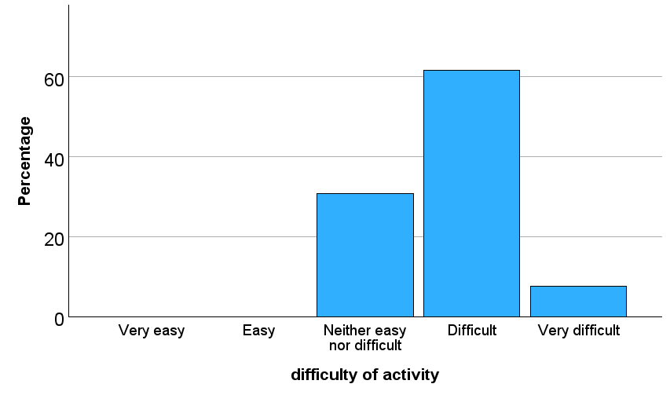
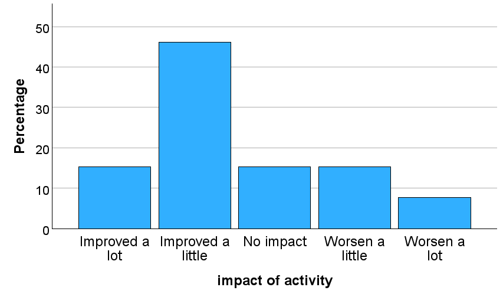
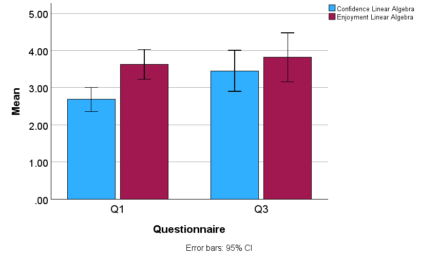

```{r setup, include=FALSE}
knitr::opts_chunk$set(echo = FALSE)
```

# Background

## University Maths

The transition to Level 2 Mathematics is challenging.


```{r linear-algebra, echo = FALSE, fig.align='center', out.width='25%'}
knitr::include_graphics("img/machine_learning.png")
```

<div class="blue3">
**Can we use co-creation pedagogy to improve students' experience of Level 2 maths courses?**
</div>

## Co-Creation in the Mathematics


* <p style="color:MidnightBlue;">Exercises and examples in mathematics education:</p>

<div class="centered">
  Participate to the construction of _concept image_ associated with a _concept definition_.
</div>

* <p style="color:MidnightBlue;">Co-creation pedagogy:</p>

<div class="centered">
  Including students in the design of the curriculum.
</div>

<div class="centered">
```{r kepp-calm, echo = FALSE, fig.align='center', out.width='20%'}

```
<font color="MidnightBlue">**Getting students to create exercises should improve their learning.**</font>
</div>

# Methods

## Data Collection 

To measure students':

* rate of <font color="FireBrick"> own confidence in and enthusiasm for</font> Linear Algebra and exercise creation

* rate of <font color="FireBrick">difficulty and impact</font> of exercise creation

* percieved <font color="FireBrick">benefits or otherwise</font> of experience


We ran  three anonymous online questionnaires (5 questions each, Likert scales and free text) and one focus group (group discussion):

* Q1: <font color="CornflowerBlue">week 2 of semester 1</font>, 

* Q2: <font color="CornflowerBlue">week 11 of semester 1</font>, 

* Q3: <font color="CornflowerBlue">week 7 of semester 2</font>,

* Focus group: <font color="CornflowerBlue">first exam week</font>.

## Data Analysis {.flexbox .vcenter}

* Quantitative data were analysed with SPSS.

* Qualitative data were analysed using Thematic Analysis (TA).

* Class sizes: 44 and 22.

* Number of responses: 19 (Q1), 13 (Q2) and 11 (Q3).

* The focus group was attended by 6 students.

# Quantitative Results

## The Linear Algebra Classes


<div class="columns-2">

```{r MA2008, echo = FALSE, fig.align='center', out.width='100%', fig.cap='46% single and joint honour maths degrees'}

```

```{r MA2508, echo = FALSE, fig.align='center', out.width='100%', fig.cap='87% single and joint honour maths degrees'}

```

</div>


## Creating Exercises in Group

**Before engaging in the activity**: 

<font color="MidnightBlue">
How do you feel about creating a mathematics exercise?
</font>

<div class="columns-2">

42% of students disclosed **<font color="DarkRed">apprehension</font>**.

26% showed **<font color="DarkCyan">curiosity</font>** about the exercise.
</div>

**After engaging in the activity**:

<div class="columns-2">

```{r difficulty, echo = FALSE, fig.align='center', out.width='100%'}

```

```{r impact, echo = FALSE, fig.align='center', out.width='100%'}

```
</div>

## Creating Exercises in Group 

The <font color="CornflowerBlue">confidence of students has increased significantly</font> between week 2 of semester 1 and week 7 of semester 2.

```{r mean-score, echo = FALSE, fig.align='center', out.width='80%'}

```

# Qualitative Results

## Thematic Analysis Results

* <p style="color:MidnightBlue;">About working in groups:</p>

<div class="centered">
  Some social challenges (organisation, time management, management of expectations and commitment)

  Resilient learning community (mutual help and sharing of knowledge, frustration and intimidation, individual vs group identity)
</div>

* <p style="color:MidnightBlue;">About creating of exercises and solutions:</p>

<div class="centered">
  Zone of Proximal Development (helps deepening knowledge and understanding, stimulating, offers a broader view of maths)
</div>

* <p style="color:MidnightBlue;">About project work in Mathematics:</p>

<div class="centered">
  Legitimate peripheral participants in the community of practice (helps getting a broader view, encourages long-term learning, motivating and rewarding).
</div>

## Thematic Analysis Results

* <p style="color:MidnightBlue;">About assessing mathematical knowledge and ability:</p>

<div class="centered">
  The lack of final exam disconcerted students. 

  They could not demonstrate their individual value.

  They recognized the value of the work they did but felt it was not replacing the traditional mode of teaching and examination.
</div>

## Conclusions {.flexbox .vcenter}

<div class="blue3">
* Co-creation activities and group work in mathematics are challenging, socially and pedagogically.

* Students recognize the benefits in term of teaching and learning.

* Students see this as a **complementary pedagogy** rather than an alternative approach.
</div>

<div class="grey3">
* How do we ask students to demonstrate their ability in mathematics?

* How can we ensure that individual contributions and abilities are recognized?

* What will be the long term impact of the experience?
</div>